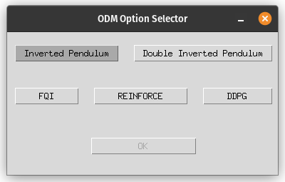
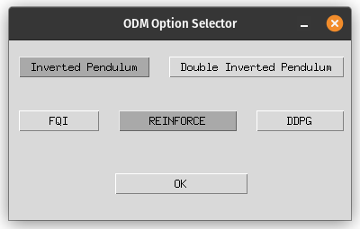
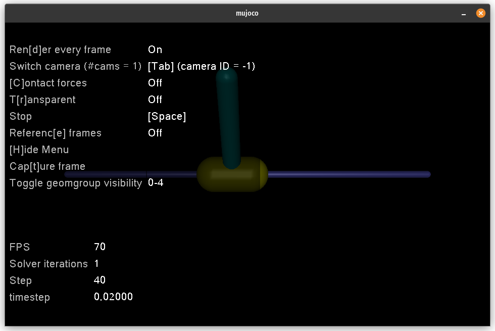

# ODM Option Selector Interface

Welcome to the ODM Option Selector Interface README. This guide will help you set up and use the interface to select options for the Inverted Pendulum and Double Inverted Pendulum environments using different algorithms.

Open this file with a Markdown reader (like VS Code) to be able to see the pictures correctly!
## Installation

First, decompress the provided zip file containing the project files. Open a terminal or command prompt and navigate to the decompressed project directory.

Install the required Python packages using the following command:

```bash
pip install -r requirements.txt
```

### Launching the Interface

To start the interface, run the following command in the terminal or command prompt:

```bash
python interface.py
```

## Using the Interface

The interface is straightforward and user-friendly, allowing you to select options with just a few clicks.

### Selecting Options

Upon launching `interface.py`, you will be presented with the ODM Option Selector window.

#### Environment Selection



- You will see two options in the top row: 'Inverted Pendulum' and 'Double Inverted Pendulum'.
- Click on the environment you wish to work with. The selected button will change color to indicate your selection. As you can see, we selected the 'Inverted Pendulum' option.

#### Algorithm Selection



- In the bottom row, you will see the algorithms available: 'FQI', 'REINFORCE', and 'DDPG'.
- Click on the algorithm you wish to apply. Similar to the environment selection, the chosen algorithm will be highlighted. As you can see, we selected the 'REINFORCE' option.

### Confirming Selection

Once you have made selections in both rows, the 'OK' button at the bottom of the window will become clickable.

- Click the 'OK' button to confirm your selections and proceed.
- After clicking 'OK', the window will close, and your selections will be processed and you will be able to see each of our selected agents controlling the selected environment!


